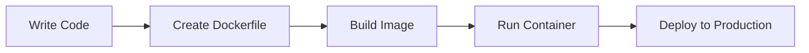

# 🐳 What is Docker?

Docker is a platform for developing, shipping, and running applications in **containers**. Think of containers as lightweight, portable packages that contain everything needed to run an application.

## 🎯 The Problem Docker Solves

### Before Docker (Traditional Deployment)
```
Application A → Server A (Python 3.8, Ubuntu 18.04, specific libraries)
Application B → Server B (Python 3.9, Ubuntu 20.04, different libraries)
Application C → Server C (Node.js 16, CentOS, specific dependencies)
```

**Problems:**
- ❌ **Environment differences** cause "works on my machine" issues
- ❌ **Dependency conflicts** between applications
- ❌ **Difficult scaling** and deployment
- ❌ **Resource waste** from underutilized servers

### After Docker (Containerized Deployment)
```
Application A → Container A (Python 3.8, Ubuntu 18.04, specific libraries)
Application B → Container B (Python 3.9, Ubuntu 20.04, different libraries)
Application C → Container C (Node.js 16, CentOS, specific dependencies)
```

**Benefits:**
- ✅ **Consistent environments** across development, testing, and production
- ✅ **Isolated dependencies** - no conflicts between applications
- ✅ **Easy scaling** - run multiple instances of the same container
- ✅ **Resource efficiency** - containers share the host OS kernel

## 🏗️ How Docker Works

### 1. **Images** 📦
- **Definition**: A read-only template containing application code, runtime, libraries, and dependencies
- **Analogy**: Like a blueprint or recipe for building containers
- **Example**: `nginx:latest`, `python:3.9-slim`, `node:16-alpine`

### 2. **Containers** 🐳
- **Definition**: Running instances of Docker images
- **Analogy**: Like a running process based on an image blueprint
- **Example**: A web server running from the `nginx:latest` image

### 3. **Docker Engine** ⚙️
- **Definition**: The runtime that manages containers, images, and networks
- **Components**: Docker daemon, REST API, and CLI client

## 🔄 Docker Workflow



### Step-by-Step Process:

1. **Develop** your application locally
2. **Create** a `Dockerfile` describing your app's environment
3. **Build** a Docker image from your code and Dockerfile
4. **Test** the image by running it as a container
5. **Deploy** the same image to production

## 🌟 Key Benefits

| Benefit | Description | Example |
|---------|-------------|---------|
| **🚀 Speed** | Start containers in seconds vs. minutes for VMs | `docker run nginx` starts in ~2 seconds |
| **📦 Portability** | Run anywhere Docker is installed | Build on Mac, run on Linux server |
| **🔒 Isolation** | Apps don't interfere with each other | Python 2.7 and 3.9 can run simultaneously |
| **📈 Scalability** | Easy to scale horizontally | `docker-compose up --scale web=5` |
| **🔄 Consistency** | Same environment everywhere | "Works on my machine" becomes reality |

## 🆚 Docker vs. Virtual Machines

| Aspect | Virtual Machine | Docker Container |
|--------|-----------------|------------------|
| **Startup Time** | Minutes | Seconds |
| **Size** | GBs | MBs |
| **Resource Usage** | High | Low |
| **Isolation** | Full OS isolation | Process isolation |
| **Portability** | Limited | Highly portable |

## 🎯 Real-World Use Cases

### 🏢 **Microservices Architecture**
```
Frontend Container → API Gateway Container → User Service Container
                                    ↓
                              Database Container
```

### 🧪 **Development Environments**
- **Team consistency**: Everyone uses the same environment
- **Easy setup**: New developers run `docker-compose up`
- **No conflicts**: Different projects use different containers

### 🚀 **Continuous Integration/Deployment**
- **Build once**: Create image in CI pipeline
- **Deploy anywhere**: Same image runs in staging and production
- **Rollback**: Easy to revert to previous image versions

## 🚀 Getting Started

Ready to try Docker? Let's run your first container:

```bash
# Pull and run the official "hello-world" image
docker run hello-world

# Run an interactive Ubuntu container
docker run -it ubuntu bash

# List running containers
docker ps

# List all containers (including stopped)
docker ps -a
```

## 📚 What's Next?

Now that you understand what Docker is, let's explore:
- **🐳 Docker Architecture** - How Docker works under the hood
- **📦 Containers vs VMs** - Detailed comparison
- **🌐 Docker Hub** - Finding and sharing images

---

**Next Up**: [🐳 Docker Architecture](./docker-architecture) →
